<h1 align="center">Yoga Studio</h1>

### Developer: Aleksander Kisielewicz

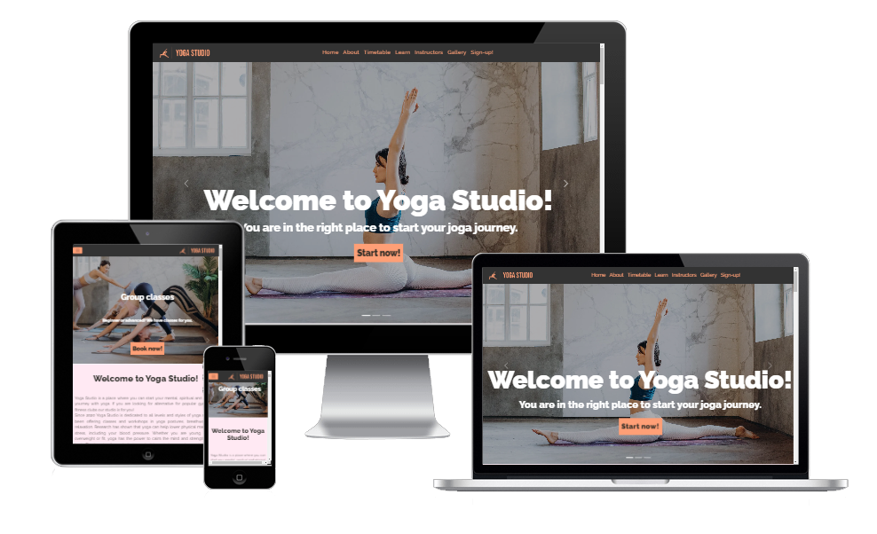

[View live website here.](https://alexkisielewicz.github.io/Portfolio-Project-1/)

[View full page screenshot](docs/screencapture-portfolio-project-1.png)

This is Yoga Studio website created as Portfolio Project #1 (HTML&CSS) for Diploma in Full Stack Software Development at [Code Institute](https://www.codeinstitute.net). It is responsive across a range of devices and it is easy to navigate for site users. 

 

# Table of content 

*   [Project](#Project)
    *   [Strategy/Scope](#strategy-scope)
    *   [Site owner goals](#site-owner-goals)
    *   [Site user goals](#site-user-goals)
*   [User Experience (UX)](#user-experience-ux)
    *   [Color Scheme](#colour-scheme)
    *   [Typography](#typography)
    *   [Structure](#structure)
*   [Technology](#technology)
    *   [Languages used](#languages-used)
    *   [Frameworks, libraries & software used](#languages-used)
*   [Testing](#testing)
    *   [Accesibility](#accesibility)
    *   [Performance](#performance)
    *   [Validation](#validation)
    *   [HTML](#html)
    *   [CSS](#css)
    *   [Browser compatibility](#browser-compatibility)
    *   [Platforms/devices](#platforms-devices)
    *   [Bugs](#bugs)
*   [Deployment](#deployment)
*   [Credits](#credits)
    *   [Code](#code)
    *   [Media](#media)
    *   [Acknowledgements](#acknowledgements)

#   Project
##  Strategy/Scope

Yoga Studio website aims to provide essential information about the studio and its offer to the user in a clear and visually pleasing way. It targets people who are looking for information about yoga and want to join local club or start learning yoga on-line. 
 

 The content is presented on scrolling page with sections dedicated to categorised informations. The <b>primary objective</b> is to find new studio members by leading them to classes booking form. With this in mind website highlights studio key points and presents yoga catagories to help users determine which is the right fit for them. <b>The secondary objective</b> is to provide on-line learning resources, giving user a choice between basic and advanced techniques.  
 
To achieve the strategy goals I implemented following features:
* simple website layout with a menu bar sticked to the top of the viewport for easy navigation,  
* a carusel with caption images and call-to-action buttons forwarding user to relevant sections,
* imformative "About" and "Learn" sections, 
* multiple call-to-action buttons across the whole page,  
* "Sign-in!" section with booking form providing feedback on submission,    
* consistent images across the whole page to immerse the user in Site Owner's story. 
 

##  User goals

- as a new user I want to:
    - navigate easily through the page, 
    - learn more about yoga, 
    - find information about Yoga Studio and it's offer, 
    - check classes timetable, 
    - check opening times,
    - check the photos from the studio to find out what's the "vibe" in there,  
    - book my classes/join the studio 
    - find out who teaches yoga, 
    - learn yoga techniques by watching tutorials, 
    - contact Yoga Studio, 
    - check address, get directions to Studio, 
    - follow Yoga Studio on social media, 

     

- as a returning user I want to:
    -   navigate easily through the page, 
    -   check classes timetable,
    -   check opening times,  
    -   contact Yoga Studio,
    -   get directions to Yoga Studio
    -   see the pictures from yoga sessions. 

## Site owner goals

- to promote Yoga Studio in the local area by offering in-studio classes and on-line by providing learning resources, 
- to provide important information about Yoga Studio, such as: business background, offered classes, classes timetable, instructors silhouettes, contact information, address, opening times, social media profiles,  
- to provide multimedia showing the studio,  
- to provide booking form for the users allowing them to join the club and starting yoga activities,    
- provide image gallery with photos from the studio to promote yoga and encourage new people to join, 
- provide social meddia links to obtain new followers who become part of Yoga Studio community, 
- to provide website that looks well across a range of devices (responsiveness).  

 

#   User Experience (UX)

##  Color Scheme

Colour palette was selected using coolors.co generator. 
For beast readability and clean look white colour was chosen for the bacgkround, "Black Chocolate #272722" for text. I chose "Light Salmon #FF9F76" colour for hover, buttons and navigation elements to stand out and delicate "Miami Pink #FFD9EA" for sections background. "French Bistre #7A6D5B" colour was used for text in the footer. "Light Gray #D0D2D6" was used for boxes shadow effect and form input hover.   

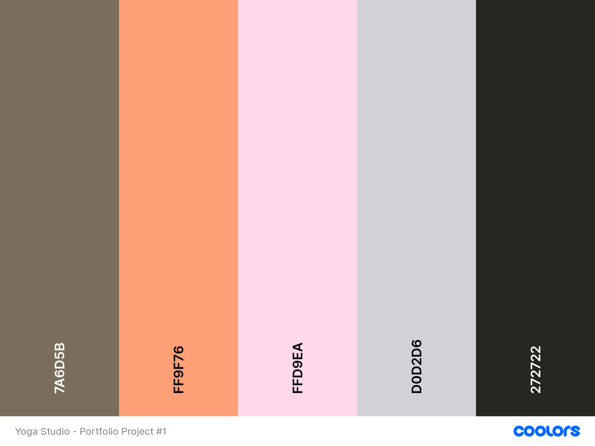

 

##  Typography

-   The Raleway font is the main font used throughout the whole website with Sans Serif as the fallback.The Raleway is a clean, modern looking font and is attractive. It is sourced from [Google fonts](https://fonts.google.com/specimen/Raleway) and it's linked to css document via @import.  

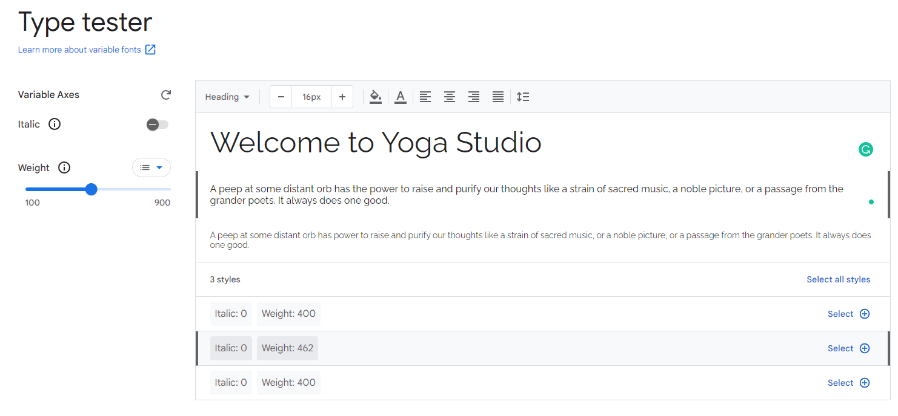

- [Type Scale](https://type-scale.com/) - tool were used to visualize different font sizes.

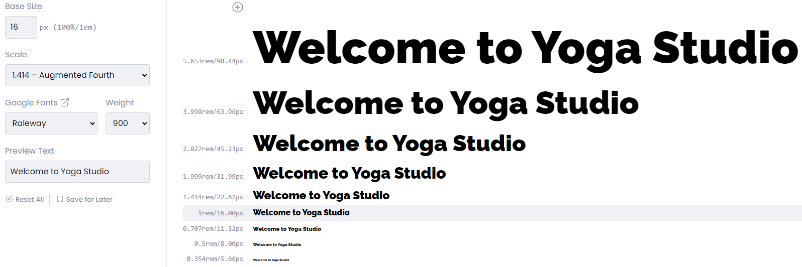

 

##  Structure

### Wireframes - [View all wireframes - PDF file](https://github.com/alexkisielewicz/Portfolio-Project-1/tree/main/docs/yoga_studio_portfolio_project_1.pdf)

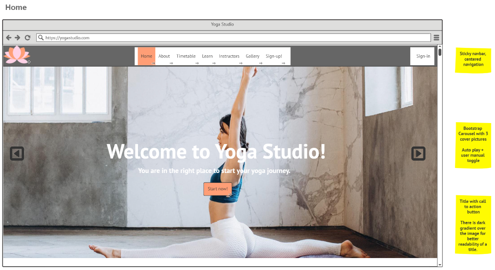

Page is designed in well known scrolling style that users like. It provides fast access to information and immerses user in the story. Navigation bar is always visible in the viewport, that reduces number of clicks to reach desirable content. Website consists of following sections: 

## Carusel
TEXT PLACEHOLDER

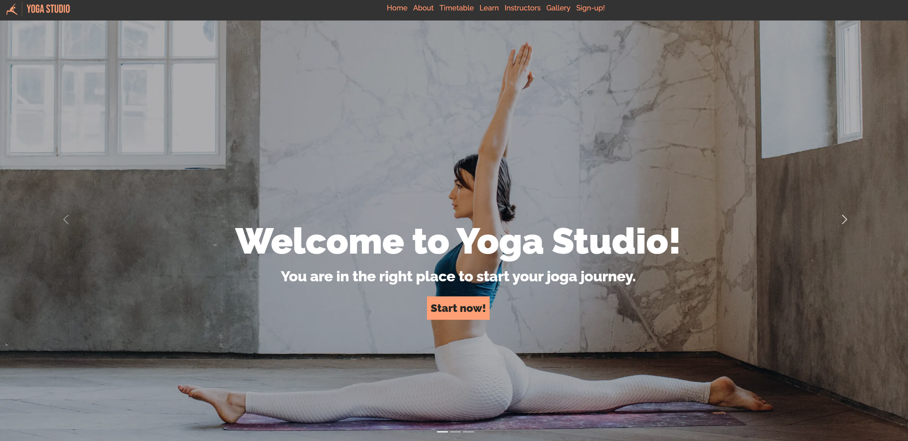

## About
TEXT PLACEHOLDER

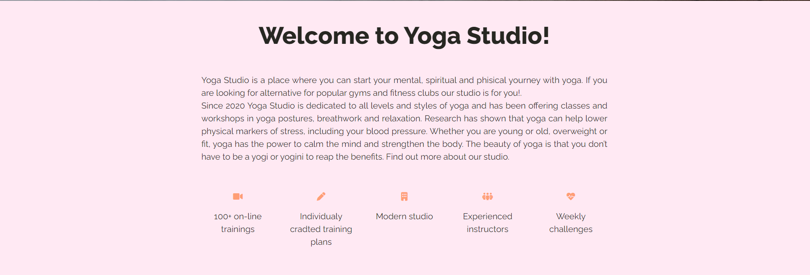

## Timetable
TEXT PLACEHOLDER

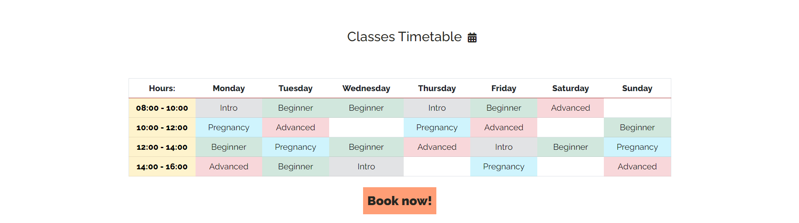

## Learn
TEXT PLACEHOLDER

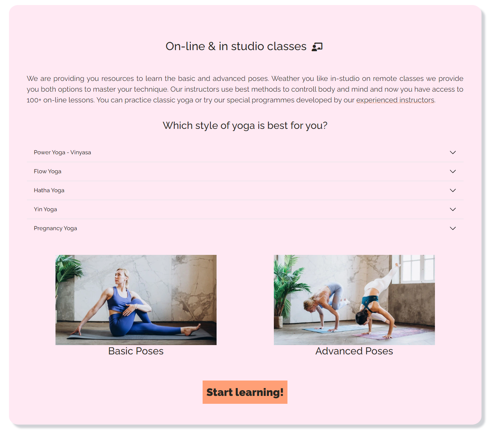

## Instructors
TEXT PLACEHOLDER

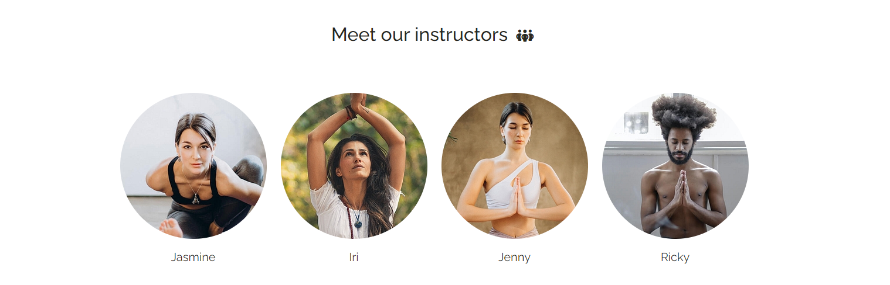

## Gallery
TEXT PLACEHOLDER

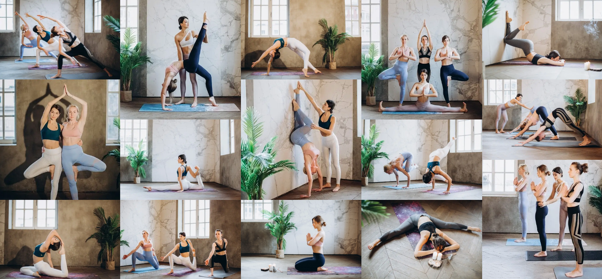

## Quote
TEXT PLACEHOLDER

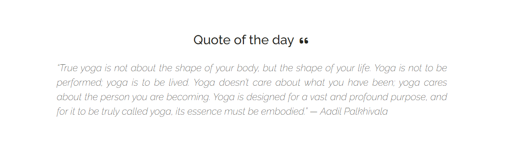

## Youtube video
TEXT PLACEHOLDER

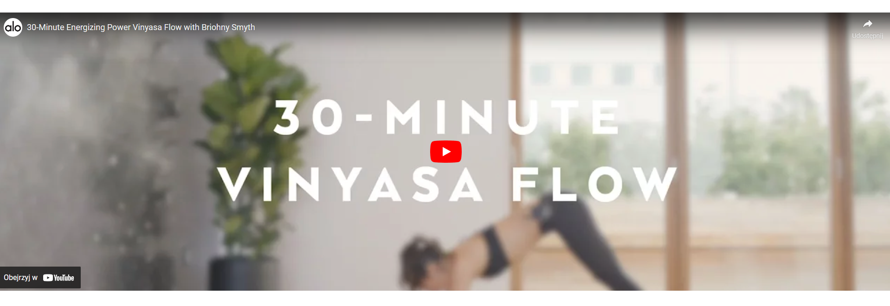

## "Sign-in" - booking form
TEXT PLACEHOLDER

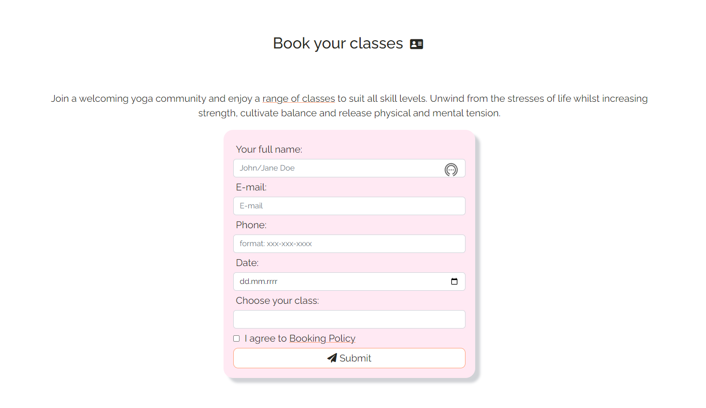

## Footer
TEXT PLACEHOLDER

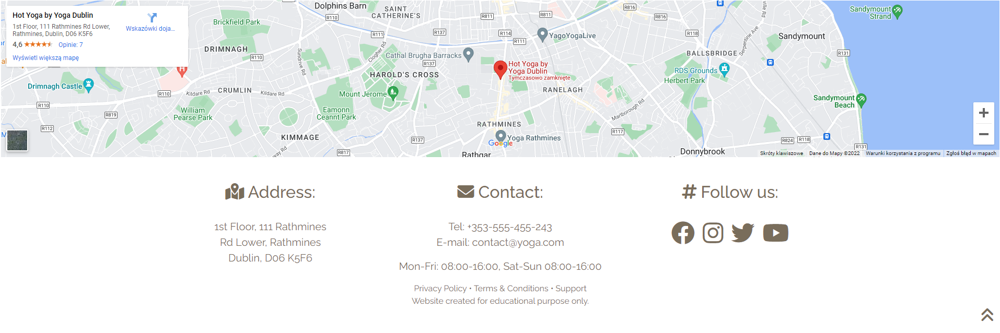

## Thank you page
TEXT PLACEHOLDER

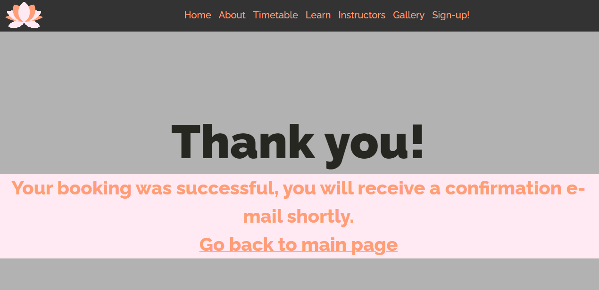

## HTTP 404 Page
TEXT PLACEHOLDER

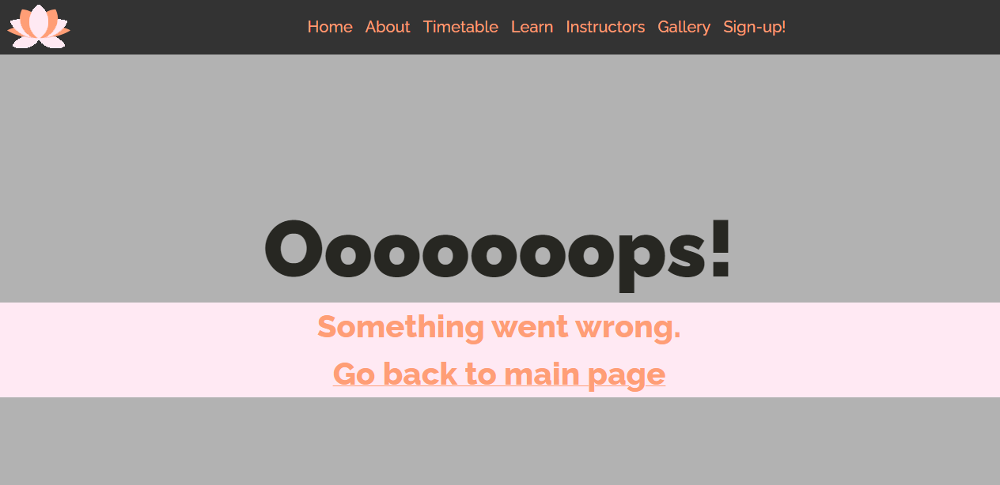

#   [Technology](#technology)
    
##  [Languages used](#languages-used)

-   [HTML5](https://en.wikipedia.org/wiki/HTML5)
-   [CSS3](https://en.wikipedia.org/wiki/Cascading_Style_Sheets)
    
##  [Frameworks, libraries & software used](#languages-used)

- [Bootstrap 5.2.0:](https://getbootstrap.com) - Bootstrap was used to create website grid and to make it responsive. Other features used and customised: 
    * Navbar,
    * Carusel,
    * Acordion,
    * Shortcode for spacing elements (eg. px-5)
- [Balsamiq](https://balsamiq.com/) - Balsamiq was used to create the [wireframes](https://github.com/) during the design process.

- [Coolors.co](https://coolors.co/) - was used to create color palette. 

- [Google Fonts](https://fonts.google.com/specimen/Raleway) - Google fonts were used to import the 'Raleway' font into the style.css file which is used on all pages throughout the project.

- [Type Scale](https://type-scale.com/) - a type tool used to visualize font size. 

- [Google Maps](https://www.google.com/maps) - was used to embed map with Yoga Studio location. 

- [YouTube](https://www.youtube.com) - was used to embed video on a website. 

- [Font Awesome:](https://fontawesome.com/) - Font Awesome was used on all pages throughout the website to add icons for aesthetic and UX purposes.

- [Git](https://git-scm.com/) - Git was used for version control by utilizing the Gitpod terminal to commit to Git and Push to GitHub.

- [GitPod](https://www.gitpod.io) - IDE used to code the project. 

- [Visual Studio Code for Windows](https://code.visualstudio.com/) - IDE used to code the project.  

- [GitHub](https://github.com/) - GitHub is used to store the projects code after being pushed from Git.

- [Photoshop](https://www.adobe.com/ie/products/photoshop.html) - Photoshop was used to resize the pictures. 

- [Adobe Express](https://express.adobe.com/) - online service used to create logo. 

- [BD_sizer](https://bd-sizer.en.softonic.com/) - used for resizeing pictures in the gallery.

- [TinyPNG](https://tinypng.com/) - used for images compression.

- [Convertio.co](https://convertio.co/jpg-webp/) - online JPG to WEBP converter. 

- [CSS Beautifier](https://www.freeformatter.com/css-beautifier.html) - used for formatting css file for optimal readability. 

- [Am I Responsive](https://ui.dev/amiresponsive) - online tool used to create mockup to present responsive design of this project. 

- [Go Full Page](https://gofullpage.com/) - Google Chrome extension used to capture full page screen shot.  

- [Lightshot](https://app.prntscr.com/) - Google Chrome extension used to capture screenshots for this README document. 

- [Lighthouse](https://developers.google.com/web) - Google webdev tool used for performance testing. 

 

#    Testing

##   Accesibility]

TEXT PLACEHOLDER 

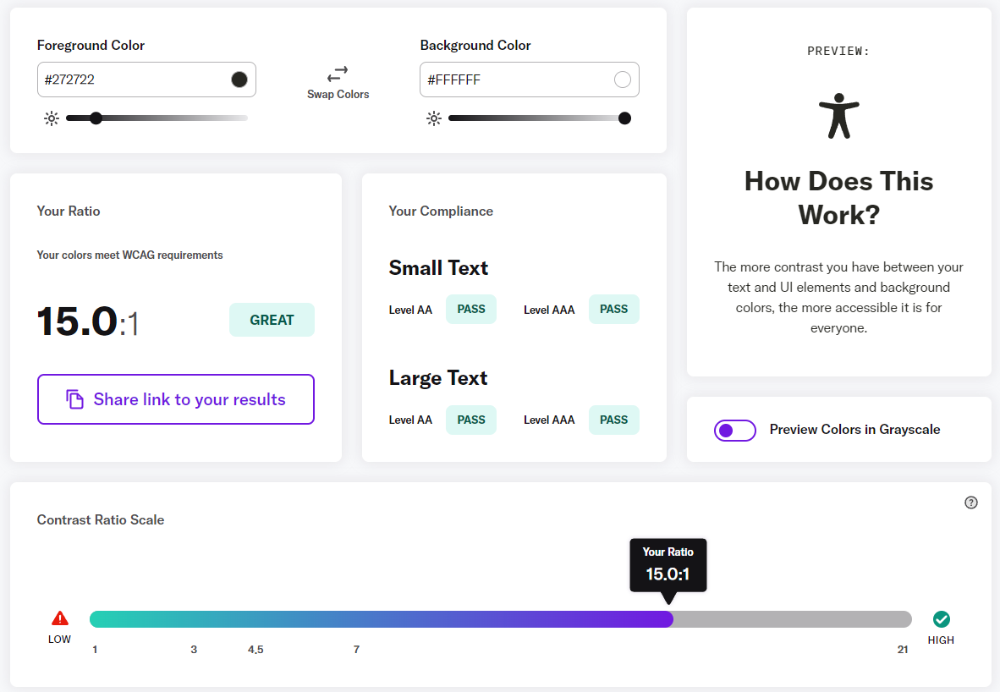 

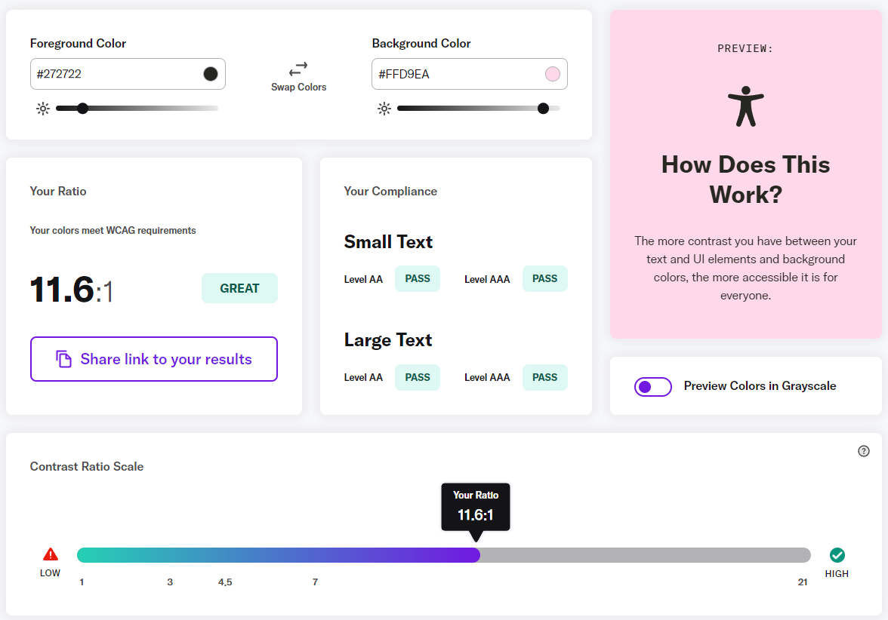 

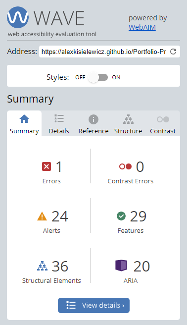

##   Performance

 [Lighthouse](https://developers.google.com/web) - Google webdev tool used for performance testing. 
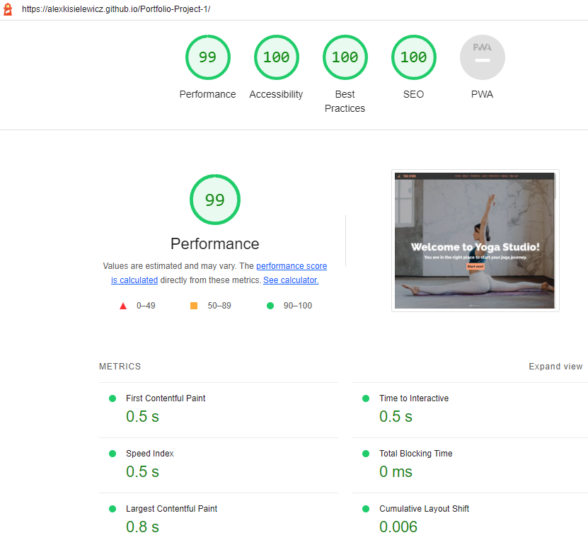

##   Validation

###   HTML

- [W3C Markup Validator](https://jigsaw.w3.org/css-validator/#validate_by_input) 

    index.html first result: 

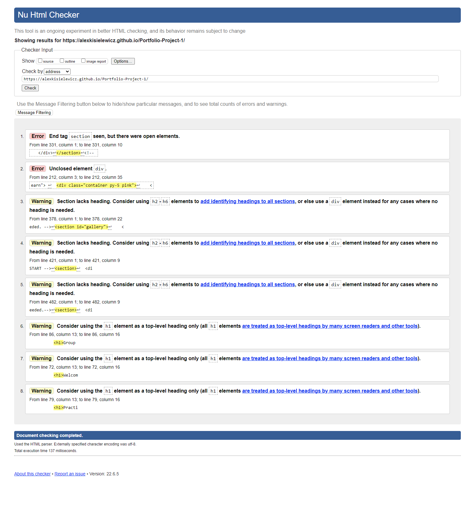

    index.html - after fixes, final result: 

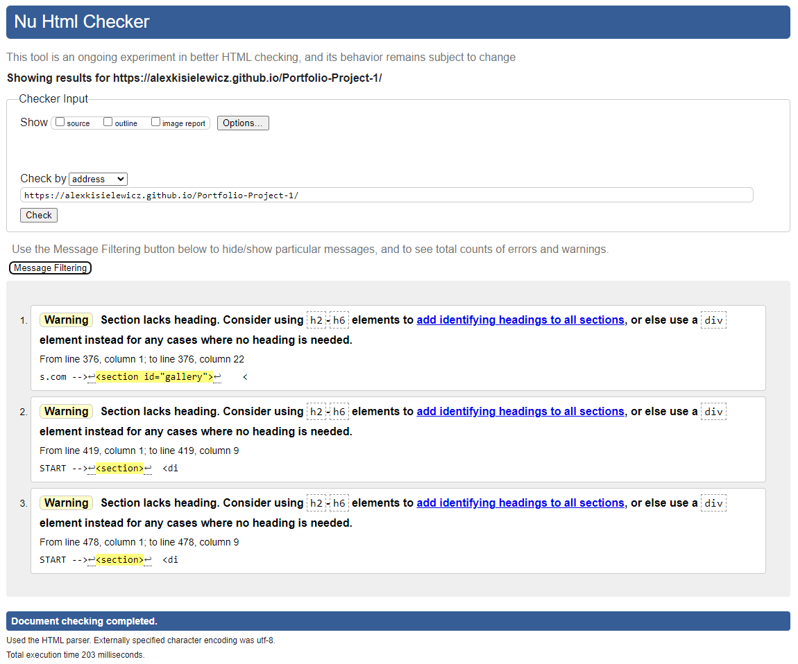

Result for 404.html page
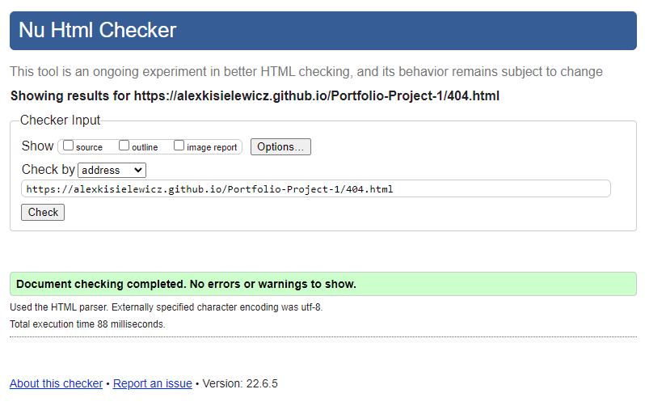

Result for thankyou.html page
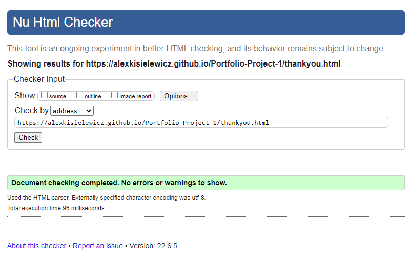 

###   CSS

- [W3C CSS Validator](https://jigsaw.w3.org/css-validator/#validate_by_input) - [Results](docs/validator_css.png)

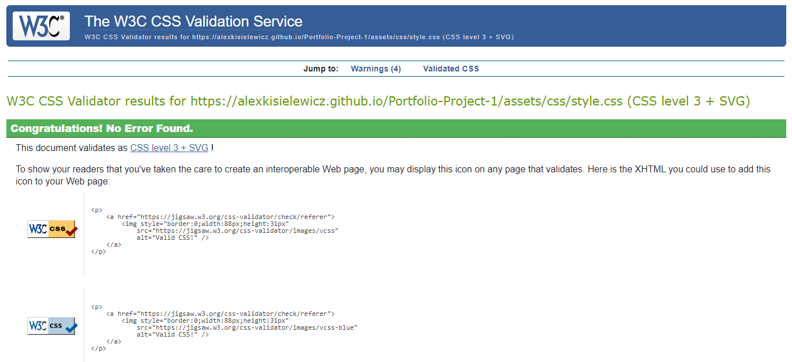

##   Browser compatibility

CHROME, SAFARI, FIREFOX, OPERA, EDGE

##   Platforms/devices

IPHONE, IPAD, LAPTOP

##   Bugs

TEXT

#   Deployment
    
The project was deployed to GitHub Pages using the following steps: 

1. Log in to GitHub and locate the [GitHub Repository](https://github.com/alexkisielewicz/Portfolio-Project-1)
2. Locate the "Settings" Button on the menu.
3. Scroll down the Settings page until you locate the "Pages" in "Code and automation" section.
4. Under "Source", click the dropdown called "Select branch:" and select "Main", click the dropdown called "Select folder" and select "/root".
5. The page will automatically refresh and you receive message "Your site is published at https://alexkisielewicz.github.io/Portfolio-Project-1/". Result below: 

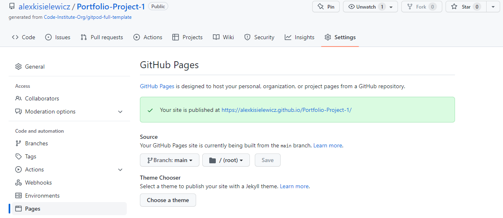

 

#   Credits

##  Code

-   [Bootstrap5.2.0](https://getbootstrap.com/) - Bootstrap Library used throughout the project mainly to make site responsive using the Bootstrap Grid System. Additional features used/implemented and customised: Navbar, Carusel, Acordion, shortcode for creating the box model and spacing elements.  
-   [MDN Web Docs](https://developer.mozilla.org/en-US/docs/Web/HTML/Element/input/tel#Pattern_validation) - phone number pattern validation code.
-   [W3C Schools](https://www.w3schools.com/howto/howto_js_image_grid.asp) - tutorial followed to create responsive image grid gallery. 
-   Code Institute README.md template has been used to create this document.  
-   Mentor Reuben Ferrante for linear gradient background code used on website cover photo element.  

##  Media

-   All images used were sourced from free stock photos [Pexels.com](https://pexels.com/) - Photographer [Elina Sazonova](https://elinasazonova.com/)
-   Descriptions of yoga styles were sourced from below websites: 
    * [Power yoga](https://www.healthline.com/health/what-is-power-yoga)
    * [Flow yoga](https://themerrymakersisters.com/what-is-flow-yoga)
    * [Hatha yoga](https://www.healthline.com/health/exercise-fitness/hatha-vs-vinyasa#about-hatha-yoga)
    * [Yin yoga](https://www.healthline.com/health/fitness/yin-yoga-poses)
    * [Pregnancy yoga](https://www.parents.com/pregnancy/my-body/fitness/prenatal-yoga-benefits/)

##  Acknowledgements

-   My Mentor Reuben Ferrante for helpful feedback and guidance at all stages of the project. 
-   Code Institute Slack Community for being invaluable knoledge base. 
-   W3C Schools for great HTML and CSS learning resources.   
-   Bootstrap Docs - for well documented crash course :)

## Disclaimer
-   <b>Yoga Studio website was created for educational purpose only.</b> 