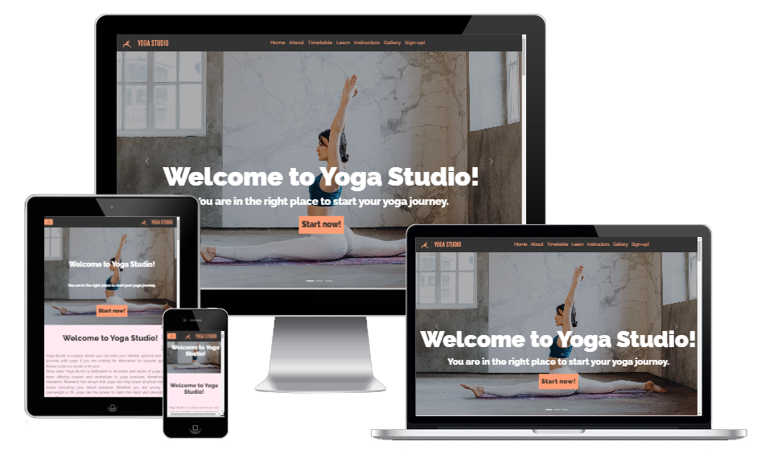
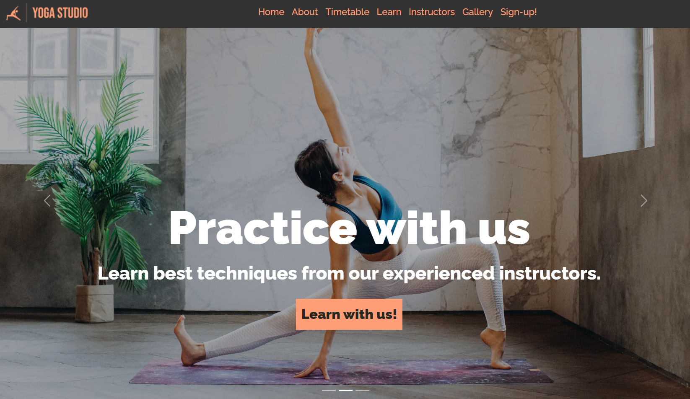
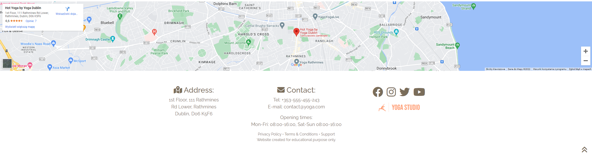
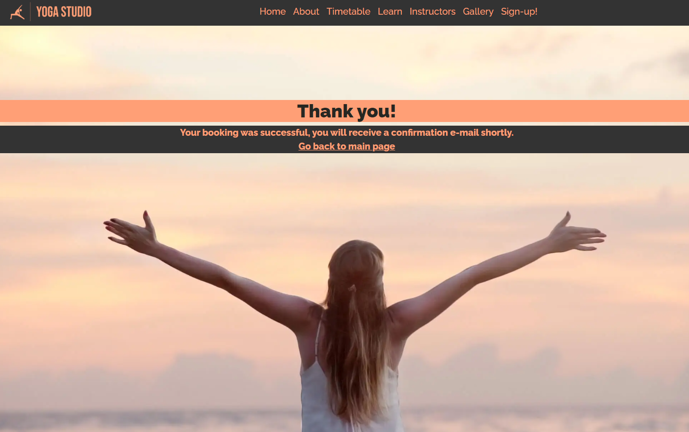
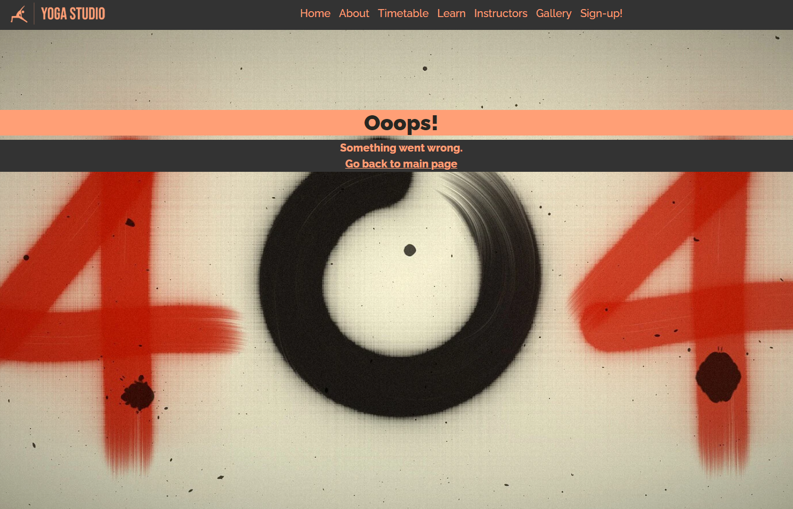
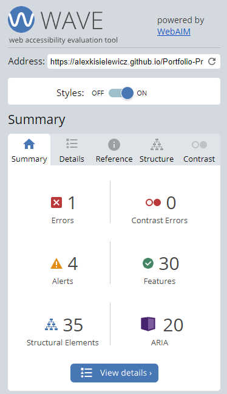
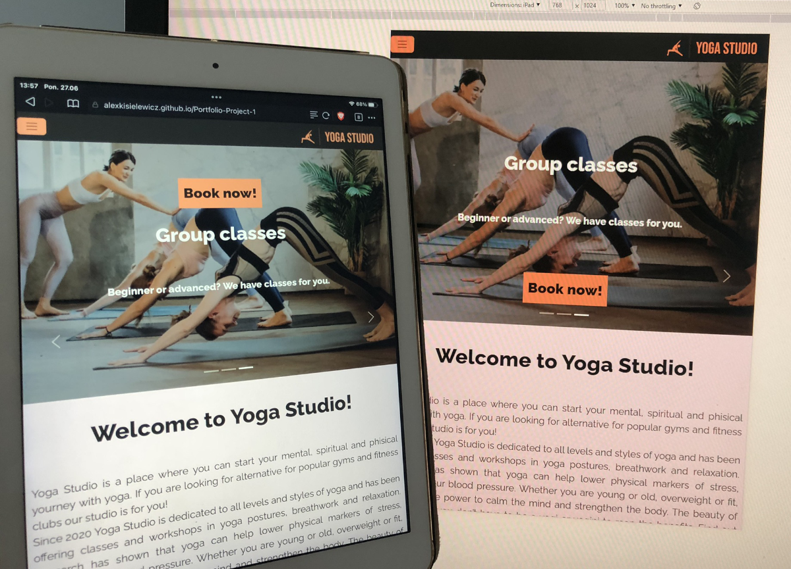

<h1 align="center">Yoga Studio</h1>

### Developer: Aleksander Kisielewicz

[View live website here](https://alexkisielewicz.github.io/Portfolio-Project-1/) :computer:

[View full page screenshot](docs/screencapture-portfolio-project-1.png)

This is Yoga Studio website created for Portfolio Project #1 (HTML&CSS) for Diploma in Full Stack Software Development at [Code Institute](https://www.codeinstitute.net). It is responsive across a range of devices and it is easy to navigate for site users. 

 

# Table of content 

*   [Project](#project)
    *   [Strategy/Scope](#strategyscope)
    *   [Site owner goals](#site-owner-goals)
    *   [Site user goals](#user-goals)
*   [User Experience (UX)](#user-experience-ux)
    *   [Color Scheme](#colour-scheme)
    *   [Typography](#typography)
    *   [Structure](#structure)
*   [Technology](#technology)
    *   [Languages used](#languages-used)
    *   [Frameworks, libraries & software used](#languages-used)
*   [Testing](#testing)
    *   [Accessibility](#accessibility)
    *   [Performance](#performance)
    *   [Validation](#validation)
    *   [HTML](#html)
    *   [CSS](#css)
    *   [Browser compatibility](#browser-compatibility)
    *   [Platforms/devices](#platformsdevices)
    *   [Bugs/known issues](#bugsknown-issues)
*   [Deployment](#deployment)
*   [Credits](#credits)
    *   [Code](#code)
    *   [Media](#media)
    *   [Acknowledgements](#acknowledgements)

#   Project
##  Strategy/Scope

Yoga Studio website aims to provide essential information about the studio and its offer to the user in a clear and visually pleasing way. It targets people who are looking for information about yoga and want to join local club or start learning yoga on-line. 
 

 The content is presented on scrolling page with sections dedicated to categorised informations. The <b>primary objective</b> is to find new studio members by leading them to classes booking form. With this in mind website highlights studio key points and presents yoga catagories to help users determine which is the right fit for them. <b>The secondary objective</b> is to provide on-line learning resources, giving user a choice between basic and advanced techniques.  
 
To achieve the strategy goals I implemented following features:
* simple website layout with a menu bar sticked to the top of the viewport for easy navigation,  
* a carousel with caption images and call-to-action buttons forwarding user to relevant sections,
* imformative "About" and "Learn" sections, 
* multiple call-to-action buttons across the whole page,  
* "Sign-in!" section with booking form providing feedback on submission,    
* consistent images across the whole page to immerse the user in Site Owner's story. 
 

## Site owner goals

- to promote Yoga Studio in the local area by offering in-studio classes and on-line by providing learning resources, 
- to provide important information about Yoga Studio, such as: business background, offered classes, classes timetable, instructors silhouettes, contact information, address, opening times, social media profiles,  
- to provide multimedia showing the studio,  
- to provide booking form for the users allowing them to join the club and starting yoga activities,    
- provide image gallery with photos from the studio to promote yoga and encourage new people to join, 
- provide social meddia links to obtain new followers who become part of Yoga Studio community, 
- to provide website that looks well across a range of devices (responsiveness).  

##  User goals

- as a new user I want to:
    - navigate easily through the page, 
    - learn more about yoga, 
    - find information about Yoga Studio and it's offer, 
    - check classes timetable, 
    - check opening times,
    - check the photos from the studio to find out what's the "vibe" in there,  
    - book my classes/join the studio 
    - find out who teaches yoga, 
    - learn yoga techniques by watching tutorials, 
    - contact Yoga Studio, 
    - check address, get directions to Studio, 
    - follow Yoga Studio on social media, 

     

- as a returning user I want to:
    -   navigate easily through the page, 
    -   check classes timetable,
    -   check opening times,  
    -   book yoga classes, 
    -   watch on-line yoga lessons,  
    -   contact Yoga Studio,
    -   get directions to Yoga Studio
    -   see the pictures from yoga sessions. 

 

#   User Experience (UX)

##  Colour Scheme

Colour palette was selected using coolors.co generator. 
For beast readability and clean look white colour was chosen for the bacgkround, "Black Chocolate #272722" for text. I chose "Light Salmon #FF9F76" colour for hover, buttons and navigation elements to stand out and delicate "Miami Pink #FFD9EA" for sections background. "French Bistre #7A6D5B" colour was used for text in the footer. "Light Gray #D0D2D6" was used for boxes shadow effect and form input hover.   

 

##  Typography

-   The Raleway font is the main font used throughout the whole website with Sans Serif as the fallback.The Raleway is a clean, modern looking font and is attractive. It is sourced from [Google fonts](https://fonts.google.com/specimen/Raleway) and it's linked to css document via @import.  

- [Type Scale](https://type-scale.com/) - tool were used to visualize different font sizes.

 

##  Structure

### Wireframes - [View all wireframes - PDF file](https://github.com/alexkisielewicz/Portfolio-Project-1/tree/main/docs/yoga_studio_portfolio_project_1.pdf)

Page is designed in well known scrolling page style that users like. It provides fast access to information and immerses user in the story. Navigation bar is always visible in the viewport, that reduces number of clicks to reach desirable content. Website consists of following sections: 

## Navbar 

The navigation bar is customised Bootstrap Navbar. It contains custom logo made using Adobe Express on-line tool and 7 links to relevant sections. All menu elements are highlighted on hover and navbar is sticked to the top of the viewport when scrolling. On small screens navbar shows well-known "hamburger" icon and collapsible menu. 

 

## Carousel

Bootstrap carousel shows 3 slides with photos that cover whole viewport on big screens. Each caption consists of Header, short slogan and call-to-action button that is linked to relevant key section. Carousel slides cycle through automaticaly but site user can take control over this function thanks to slider buttons and active slide indicator.  

## About
The About section is descriptive part of a website and provides information about company's goal and purpose. It also promotes yoga as activity that brings healt benefits to the user. The business key points are presented using row of icons. Use of negative space make it easy for user to read the content and focus on important parts. 

## Timetable
Timetable section contains of a table presenting information about weekly activities in the studio. The classes are cetagorised in gour levels: intro, beginner, advanced and pregnancy. The cells of each category are highlited in different colour. The table is scrollable horizontaly on smaller screens. Underneath the table there is call-to-action button linked to class booking form.     

## Learn
In this section there is a short decription of company's offer. Bootstrap accordion feature has been used to accomodate five headers and paragpraphs describing different yoga styles and offered classes. For those who are looking for on-line learning resources, there are two categories of lessons - for beginner and advanced user. I imagine that full content of articles and video lessons would be available on those sub pages.     

## Instructors
This section presents photo avatars of yoga instructors working in Yoga Studio. Sup pages would present full silhouettes of each instructor. 

## Gallery
The image gallery contains visually consistent and eye-pleasing photographs that provide user an insight of how Yoga Studio looks like and what is the "vibe" in there. Photo grid is made of 5 columns by 3 pictures in each column. It takes all viewport width and is responsive on all devices. On a smaller screens up to 600px wide, a single photo takes all screen width. The grid layout idea was inspired by tutorial found on [w3cschhols.com](https://www.w3schools.com/howto/howto_js_image_grid.asp) 

## Quote

The "Quote of the day" section displays a yoga related quote that should motivate user, attract him to yoga or persuade him to make a contact or booking.  

## Youtube video
Video section presents full width iframe that contains YouTube video with relevant content. It links the user with business's YouTube channel and encourage him to interact longer with the content and build deeper interest in yoga and as a result - to become new customer. 

## "Sign-in" - booking form
The booking form is a key point of a website where user is being led consequently to make interaction and join the business as a new customer. All form fields are marked as required and are validated. The form provides feedback in case the users input is incorrect. Date select field requires further script to prevent user from picking a date from the past. Upon successful completion of the form website provides user a feedback by transfering him to thankyou.html page.    

## Footer
The classic footer is preceded by Google Map section that indicated precise location of Yoga Studio. The footer contains of three columns, that provides information accordingly about address, contact and opening hours. The last column presents social media icons that encourage user to follow the business on various platforms. In bottom right corner of a website is  located an icon with "back to top" link.    

## Thank you page
The page where user is transferred to upon successful completion of the booking form. User doesn't have to use browser "go back" button, the link to the main page is provided.      

## HTTP 404 Page
An error page in case that user tries to open a website that cannot be found on the web server. User doesn't have to use browser "go back" button, the link to the main page is provided.      

#   [Technology](#technology)
    
##  [Languages used](#languages-used)

-   [HTML5](https://en.wikipedia.org/wiki/HTML5)
-   [CSS3](https://en.wikipedia.org/wiki/Cascading_Style_Sheets)
    
##  [Frameworks, libraries & software used](#languages-used)

- [Bootstrap 5.2.0:](https://getbootstrap.com) - Bootstrap was used to create website grid and to make it responsive. Other features used and customised: 
    * Navbar,
    * Carousel,
    * Acordion,
    * Shortcode for spacing elements and table cell background colour (eg. px-5, warning). 
- [Balsamiq](https://balsamiq.com/) - Balsamiq was used to create the [wireframes](#structure) during the design process.

- [Coolors.co](https://coolors.co/) - was used to create color palette. 

- [Google Fonts](https://fonts.google.com/specimen/Raleway) - Google fonts were used to import the 'Raleway' font into the style.css file which is used on all pages throughout the project.

- [Type Scale](https://type-scale.com/) - a type tool used to visualize font size. 

- [Google Maps](https://www.google.com/maps) - was used to embed map with Yoga Studio location. 

- [YouTube](https://www.youtube.com) - was used to embed video on a website. 

- [Font Awesome:](https://fontawesome.com/) - Font Awesome was used on all pages throughout the website to add icons for aesthetic and UX purposes.

- [Git](https://git-scm.com/) - Git was used for version control by utilizing the Gitpod terminal to commit to Git and Push to GitHub.

- [GitPod](https://www.gitpod.io) - IDE used to code the project. 

- [Visual Studio Code for Windows](https://code.visualstudio.com/) - IDE used to code the project.  

- [GitHub](https://github.com/) - GitHub is used to store the project's code after being pushed from Git.

- [Adobe Photoshop](https://www.adobe.com/ie/products/photoshop.html) - Photoshop was used to resize the pictures. 

- [Adobe Express](https://express.adobe.com/) - online service used to create logo. 

- [Audioyey.com](https://www.audioeye.com/color-contrast-checker) - used to analyse contrast. 

- [BD_sizer](https://bd-sizer.en.softonic.com/) - used for resizeing pictures in the gallery.

- [TinyPNG](https://tinypng.com/) - used for images compression.

- [Convertio.co](https://convertio.co/jpg-webp/) - online JPG to WEBP converter. 

- [CSS Beautifier](https://www.freeformatter.com/css-beautifier.html) - used for formatting css file for optimal readability. 

- [Am I Responsive](https://ui.dev/amiresponsive) - online tool used to create mockup to present responsive design of this project. 

- [Go Full Page](https://gofullpage.com/) - Google Chrome extension used to capture full page screen shot.  

- [Lightshot](https://app.prntscr.com/) - Google Chrome extension used to capture screenshots for this README document. 

- [Lighthouse](https://developers.google.com/web) - Google webdev tool used for performance testing. 

- [Wave Web Accessibility Evaluation Tool](https://wave.webaim.org/) - used to validate accessibility. 

- [Favicon.io](https://www.favicon.io) - tool used to create favicon. 

 

#    Testing

##   Accessibility

TEXT PLACEHOLDER 

 

 

[WAVE](https://wave.webaim.org/) Web Accessibility Evaluation Tool was used to check accessibility. It reported one error "Missing alternative text". It is related to carousel background photo linked via CSS stylesheet. Alternative text cannot be set in this case. Four alerts are minor and related to justified text in the paragraphs. 

##   Performance

 [Lighthouse](https://developers.google.com/web) - Google webdev tool used for performance testing.  

##   Validation

###   HTML

- [W3C Markup Validator](https://validator.w3.org/nu/) 

:x: index.html - first result found 2 errors that refer to unclosed element and missing open element.  
Three warnings refer to lack of heading in sections such as Gallery, YouTube video or Google Map and also recommend using h2-h6 headers instead of h1 used in Carousel caption.  

 

:heavy_check_mark: index.html - after error fixes, final result: 

Result for 404.html page :heavy_check_mark:
 

Result for thankyou.html page :heavy_check_mark:
 

###   CSS

- [W3C CSS Validator](https://jigsaw.w3.org/css-validator/#validate_by_input) - Result: No Error Found. :heavy_check_mark:

##   Browser compatibility

Website was manually tested on following browsers: Google Chrome, Edge, Firefox, Safari, Brave. 

##   Platforms/devices 

Website was tested manually on Apple Iphone X, Apple iPad, Apple Macbook Air, Ultrawide display 3440x1440, 2560x1440. 

##   Bugs/known issues

There was a minor issue spotted. Google Dev tools and Apple iPAD display position of "call to action" button in different way. My intention was to place it underneath the carousel caption text. Ipad displays it on top of the caption.  

#   Deployment
    
The project was deployed to GitHub Pages using the following steps: 

1. Log in to GitHub and locate the [GitHub Repository 
Portfolio-Project-1](https://github.com/alexkisielewicz/Portfolio-Project-1)
2. Locate the "Settings" Button on the menu.
3. Scroll down the Settings page until you locate the "Pages" in "Code and automation" section.
4. Under "Source", click the dropdown called "Select branch:" and select "Main", click the dropdown called "Select folder" and select "/root".
5. The page will automatically refresh and you receive message "Your site is published at https://alexkisielewicz.github.io/Portfolio-Project-1/". Result below: 

 

#   Credits

##  Code

-   [Bootstrap5.2.0](https://getbootstrap.com/) - Bootstrap Library used throughout the project mainly to make site responsive using the Bootstrap Grid System. Additional features used/implemented and customised: Navbar, Carousel, Acordion, shortcode for aligning and spacing elements.  
-   [MDN Web Docs](https://developer.mozilla.org/en-US/docs/Web/HTML/Element/input/tel#Pattern_validation) - phone number pattern validation code.
-   [W3C Schools](https://www.w3schools.com/howto/howto_js_image_grid.asp) - inspiration to create responsive image grid gallery. 
-   Code Institute README.md template has been used to create this document. 

##  Media

-   All images used were sourced from free stock photos [Pexels.com](https://pexels.com/) - Photographer [Elina Sazonova](https://elinasazonova.com/)
-   Descriptions of yoga styles were sourced from following websites: 
    * [Power yoga](https://www.healthline.com/health/what-is-power-yoga)
    * [Flow yoga](https://themerrymakersisters.com/what-is-flow-yoga)
    * [Hatha yoga](https://www.healthline.com/health/exercise-fitness/hatha-vs-vinyasa#about-hatha-yoga)
    * [Yin yoga](https://www.healthline.com/health/fitness/yin-yoga-poses)
    * [Pregnancy yoga](https://www.parents.com/pregnancy/my-body/fitness/prenatal-yoga-benefits/)

##  Acknowledgements

-   My Mentor Reuben Ferrante for helpful feedback and guidance at all stages of the project. 
-   Code Institute Slack Community for being invaluable knoledge base. 
-   W3C Schools for great HTML and CSS learning resources.   
-   Bootstrap Docs - for well documented crash course :)

## Disclaimer
-   <b>Yoga Studio website was created for educational purpose only.</b> 